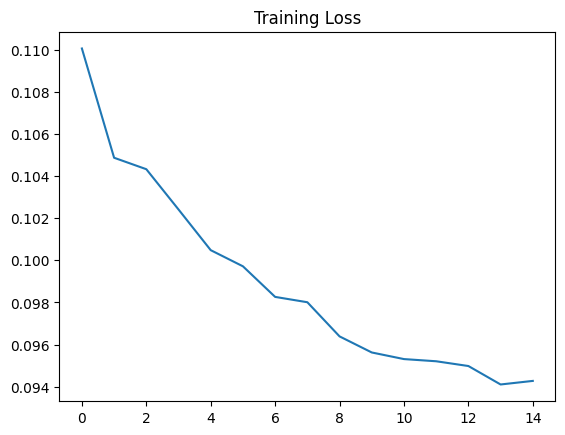
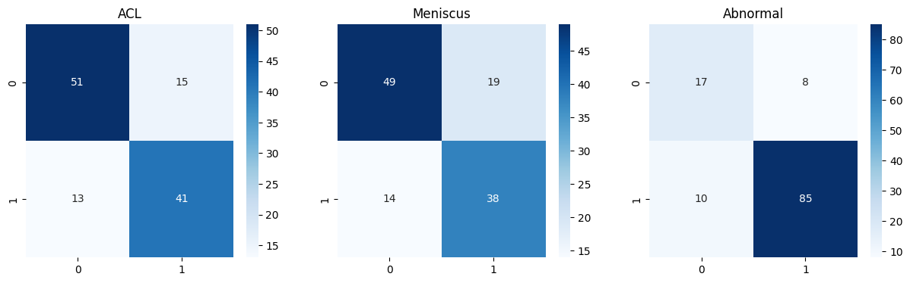
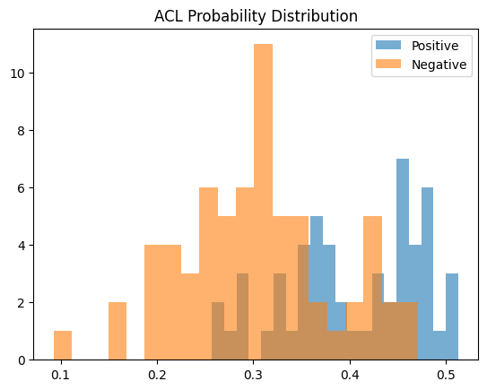
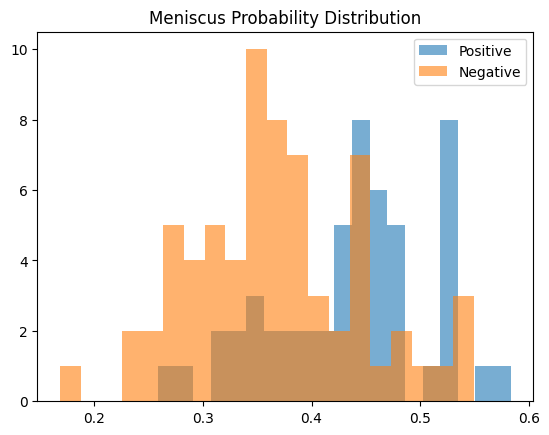
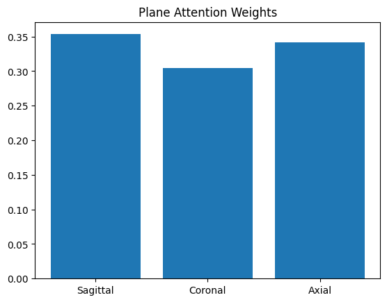

Slides: [slides.html](slides.html){target="_blank"} ( Go to `slides.qmd`
to edit)

## 1 Introduction

Musculoskeletal disorders affecting knee and related tissues like osteoarthritis, ACL injury and meniscal injury are widespread and greatly affect quality of life and mobility of patients globally. Current methods for diagnosis include X-ray radiography but these are ineffective for soft tissue diagnosis and, hence, diagnosis of early changes are often delayed until knee is significantly degenerated [@panwar2025early]. On the other hand, magnetic resonance imaging has emerged as a leading diagnostic method for musculoskeletal and sports medicine imaging due to several features, like high contrast resolution and multiplanar imaging, which can aid in thorough evaluation of large joints, like knee along with ligaments, cartilage, bone, tendons, and muscles, and provides distinct images of different soft tissues to get a complete overview [@qiu2021fusion]. However, current methods of MRI scans analysis manually pose huge challenge for radiologists due to time consumption, high rate of errors, low reproducibility, heavy cognitive load, and high inter-observer variability [@bien2018deep].

Manual segmentation of knee structures is a time-consuming step in MRI-based knee assessment. Deep learning methods can potentially improve this process by enabling fast and reproducible automated segmentation of knee tissues. In their study, [@zhou2018deep] developed a deep convolutional neural network for automatic cartilage and meniscus segmentation of knee joints, achieving highly accurate results for multiple types of knee tissues, to facilitate efficient assessment of knee anatomy and pathology.

Artificial intelligence techniques based on deep learning (DL), particularly deep learning Convolutional Neural Networks (CNNs), allow for automated, objective, and scaleable image analysis, which constitutes a major paradigm shift for overcoming challenges in medical diagnostics. CNNs are especially suited for the analysis of medical images since they have the ability to learn automatically hierarchical features directly from raw pixel data. Including pathological changes that the human eye cannot even detect. 2D and 3D CNN models have recently shown promising results in the segmentation and even grading of musculoskeletal tissues and degree of damage of their structures. Although crucial advances have been achieved, however, there are more important challenges to be addressed, including the acquisition and labeling of a large, high-quality dataset and the lack of generalization capability in different MRI platforms and hardware.

Fast diagnosis and monitoring of patients is a current challenge. To address this problem, efficient automated systems for the multiplex detection in time-consuming workflows are needed to help doctors. The problem of discrimination of multiple co-occurring knee injuries in the knee is still an open challenging problem. Based on recent CNN models, in this paper we present an automated system for the detection of various knee common injuries and degeneration from knee MRI images. The system can enable early intervention and help develop strategies for better patient care.

Knee osteoarthritis assessment based on visual inspection of clinical images is traditionally time-consuming and operator-dependent. Recent studies indicate that knee osteoarthritis can be automatically detected from imaging data using a deep learning-based convolutional neural network (CNN) approach, resulting in robust and accurate classification.

Can a 3D convolutional neural network learn spatial and anatomical information from a multi-plane knee MRI volume to accurately identify multiple knee pathologies? Yes, we can. In this study, we trained a 3D CNN to identify 3 different knee pathologies simultaneously, namely ACL tears, meniscus tears and knee abnormalities.

To achieve this goal, a custom deep learning architecture, using a 3D Convolutional Neural Network (CNN), was implemented and fine-tuned on the large image dataset MRNet provided by the Stanford University. The aim of the novel architecture is to distinguish between three different knee pathologies: normal knee, knee with an ACL tear and knee with a meniscus tear. In summary, three individual binary classification problems were formulated and performed in parallel. The network therefore classified images into three categories: presence or absence of an ACL tear, presence or absence of a meniscus tear, and presence or absence of any other abnormalities.

The performance of our approach was individually evaluated for each type of classification in terms of Area Under the ROC Curve (AUC), accuracy, sensitivity and specificity. However, to provide an idea of clinical applicability, we have also tested the approach for all knee pathologies simultaneously.

## 2 Methodology

### Convolutional Neural Network (CNN)

A Convolutional Neural Network or (CNN) is a deep learning model which processes structured data. CNNs have been adopted due to their remarkable efficiency in image processing and medical imaging applications. In such systems, the CNN can automatically extract vital features directly from images without the requirement for manually extracting features.

In the early layers of a deep CNN, it is possible to observe the learning of basic spatial features, such as gradients and structural contours. In the subsequent layers, the network continues to learn more complex and abstract features related to normal and pathological tissues, such as severely degenerated cartilage or ACL fibers disruption.

Commonly, 1D, 2D or even 3D CNNs are employed for processing sequential data. For image data, however, 2D CNNs are standard practice since individual 2D slices are processed. For volumetric data, however, a 3D convolution operation can be performed that considers not only the neighbour pixels in height and width but also in depth. This is particularly relevant for MRI data, where slices are highly correlated.

Deep learning techniques such as 3D CNNs have achieved state-of-the-art results in knee MRI for the detection and grading of ACL tears as well as for the assessment of meniscal tears and osteoarthritis. Inter-slice spatial relationships are crucial for the adequate understanding of 3D knee anatomy, and 3D CNNs are currently the most advanced artificial intelligence approach in orthopedic imaging, in pursuit of computerized diagnosis.

### Basic Architecture of a CNN

 
A typical CNN consists of several key components that enable hierarchical feature extraction and classification [@yeoh2021emergence;@awan2021improved].

<center>

</center>

**1. Convolution Layer**

Applies filters (kernels) to extract features from input images.

      Mathematical representation:
$$
Y(i,j) = \sum_{m}\sum_{n} \left[ X(i+m, j+n)\cdot W(m,n) \right] + b
$$


Where:
- $X$ = Input image
- $W$ = Filter/kernel
- $b$ = Bias
- $Y$ = Output feature map

This operation allows CNNs to learn spatially localized features and is fundamental to many medical image analysis frameworks [@yeoh2021emergence; @qiu2021fusion].
	
**2. Activation Function**

In order to enable a deep neural network to learn also complex features, it is common to use non-linear activation functions after the convolutional layers. The most common used activation function in that context is the Rectified Linear Unit (ReLU).


$$
f(x) = \max(0, x)
$$

ReLU facilitates faster training and is known to overcome vanishing gradients when compared to traditional sigmoid and tanh functions in deep learning architectures.

**3. Pooling Layer**

The pooling layers reduce the spatial dimensions of the feature maps extracted from input images keeping only the most relevant information. Among the different types of pooling operations, max pooling is the most popular one. In the max pooling approach, the model selects the maximum value within a defined window during a sliding operation. It helps in reducing the number of parameters and contributes to the model’s robustness for small spatial variations across images.

**4. Fully Connected Layer**

These classification layers learn features from previous layers and use these features to determine a target classification (e.g. the presence of a knee pathology, severity of knee pathology, etc.), such as in [@awan2021improved] improved knee-OD diagnostic model.

**5. Output Layer**

Uses Softmax (multi-class) or Sigmoid (binary/multi-label).

Deep learning techniques, particularly convolutional neural networks (CNNs), have achieved outstanding performance in several medical imaging applications, including MRI-based disease diagnosis and tissue segmentation.

---

### Types of CNN:

Deep Neural Networks known as CNNs are categorized based on the dimensionality of the input data and the sliding direction of the kernel.

| Feature | Type of input data used to construct the feature | Direction of movement allowed for the kernel in the feature |
|--------|--------------------|-----------------|
| 1D CNN | Time-series, audio, ECG signals (Ige & Sibiya, 2024). | These filters move across the 1D data (time/sequence) instead of the regular 2D images.
| 2D CNN | 2D input features (e.g. 2D images such as: Grayscale/RGB images, medical X-rays). | 2D regions (slides over height dimension, then width dimension). |
| 3D CNN | Videos, MRI/CT scans, 3D point clouds [@guida2021knee]. | The network slides along three dimensions (height, width, and depth). |
: Single and Multi-Path Architectures in CNNs - Table 1 {.striped .hover}

---

### 3D Convolutional Neural Networks:

A 3D Convolutional Neural Network (3D CNN) is a natural extension to the standard 2D Convolutional Neural Network (2D CNN) architecture for handling volumetric data by employing three-dimensional convolutional kernels that slide over all three spatial dimensions (i.e., height, width, and depth). Unlike 2D CNNs, which treat each 2D image slice independently, 3D CNNs maintain the spatial relationships between slices and leverage these relationships to learn more effective anatomical features from the entire volume. This architecture is especially beneficial for many medical imaging modalities, such as MRI, where relevant information extends several slices in depth.

Current approaches for 3D medical image analysis using deep learning methods are mostly based on 3D CNNs. Typically, a 3D CNN consists of repeated 3D convolutional layers (convolutions) followed by nonlinear activation functions, 3D pooling layers (down-sampling) and fully connected layers (classification). The early layers learn low-level volumetric features (edges, textures etc.) and the deeper layers learn high-level features representing organs or diseases. In terms of computational costs 3D CNNs are significantly more expensive than 2D CNNs but yield state of the art results in volumetric classification, detection and segmentation tasks.

Three-dimensional convolutional neural networks (3D CNNs) have been successfully employed in multiple tasks in knee MRI analysis. Building on these results, in this work, we develop a deep learning network, MRNet, capable of accurately diagnosing anterior cruciate ligament tears and abnormalities of the meniscal structures. In another work,[@pedoia20193d]  3D CNNs were employed for the detection. In osteoarthritis, knee MRI scans can classify the severity of knee osteoarthritis. In this work,[@guida2021knee]  a 3D CNN was trained to classify knee MRI scans according to the degree of knee osteoarthritis.

Besides classification, 3D CNNs have also been explored for various anatomical segmentation tasks. For example, [@zhou2018deep], [@liu2018deep] developed deep convolutional networks that, combined with deformable modeling, enable accurate tissue segmentation of the knee joint, an essential component for quantitative musculoskeletal assessment.

Researches have made further progress in enhancing capabilities of CNN-based systems for improving knee injuries, especially ACL tear detection and knee osteoarthritis grading. Self-supervised learning with methods like BYOL can be used to reduce the need of large datasets with corresponding labels. Instead, federated learning approach can be used to develop and share a system for knee injuries across institutions without even sharing patient data. Emerging frameworks for multimodal and continuous monitoring suggest that developed AI systems will be integrated into future orthopedic care systems. Additionally, alternative models like Vision Transformers are being explored for osteoarthritis grading. 3D CNNs are still one of the preferred solutions for volumetric knee MRI analysis.

3D CNNs have significant potential in musculoskeletal imaging for the detection, classification, grading and segmentation of knee pathologies in an automated fashion. This architecture preserves the 3D spatial relationships within the images enabling an anatomical understanding of the disease.

The 3D convolution is defined as:
  
$$
Y(i,j,k) = \sum_{m}\sum_{n}\sum_{p} X(i+m, j+n, k+p)\cdot W(m,n,p) + b
$$

Where:

- $X$ = Input 3D MRI volume
- $W$ = 3D convolution kernel
- $b$ = Bias
- $Y$ = Output feature map
- $i,j,k$ = Spatial voxel indices

This operation extracts volumetric features across depth, height, and width.[@guida2021knee].


#### Applications in Knee MRI Analysis

3D Convolutional Neural Networks (3D CNN) have shown great potential in processing musculoskeletal images, especially knee MRI.

- **Tissue Segmentation:** The techniques in this subcategory, including several deep CNN-based architectures developed in 2018, such as DDN, DCAN, and AC-Net, have been able to achieve results for knee joint anatomy segmentation and improved tissue segmentation accuracy by [@liu2018deep] and [@zhou2018deep].

- **Meniscus and Cartilage Degeneration Detection:** In[@pedoia20193d], 3D CNNs were used to identify and staging of degenerative changes of meniscus and patellofemoral cartilage. Special attention was paid to extract volumetric features from knee MRI scans.

- **Osteoarthritis Classification:** Classification of knee osteoarthritis in knee by [@guida2021knee] using MRI scan using deep learning technique 3D CNN. It achieves higher accuracy compared to the 2D technique. Classification and severity assessment of osteoarthritis using CNN technique is also shown by [@rani2024deep].

- **ACL Tear Detection:** ACL tears can be detected from the knee MRI scan using the deep learning technique MRNet proposed in[@bien2018deep] and then improved using more efficient learning techniques such as self-supervised learning.

- **Multimodal and Federated Learning Approaches** New frameworks have been derived to combine 3D CNNs with federated and few-shot learning techniques to improve generalization across institutions. The potential of AI-based multimodal systems for orthopedic diagnostics has been demonstrated.

#### Performance and Advantages:

3D CNNs provide significant benefits in medical imaging:

- **Volumetric Context:** Features from adjacent slices are taken into account, bio-markers for certain conditions, such as cartilage degradation, that are not present in single 2D images can be detected.

- **Higher Accuracy:** Evidence from brain and knee imaging studies shows that 3D model has higher accuracy compared to 2D and 2.5D approaches.

- **Efficiency in Convergence:** For volumetric data, 3D models can often converge 20% to 40% faster than their 2D equivalents as the model learns.

#### Limitations and Assumptions

Despite their power, 3D CNNs face specific challenges:

- **Computational Cost:** 3D models need huge amount of memory to run which is around 20 times bigger than 2D models to view and interact [@avesta2023comparing].

- **Large Data Requirements:**
Large annotated datasets are the primary requirement to achieve the highest accuracy for CNNs. However, for medical image datasets, these datasets are small and expensive to obtain and manually label, which in turn hampers the generalisation performance of the learnt models. In recent years, self-supervised learning has emerged as a promising technique for expanding the current repertoire of CNNs to tackle these challenges.

- **Risk of Overfitting:**
One of the major challenges faced by the researchers during CT image segmentation is the overfitting of the CNN due to limited number of medical images. Usually 3D CNNs are employed to tackle this problem which also increase the overfitting because of depth. 

## 3 Analysis & Results:


**3.1 Dataset Description:**

The MRNet dataset, a publicly available set of knee MRI scans gathered by the School of Medicine at Stanford University, is used in this research. The dataset contains images gathered from clinical studies performed at the Stanford University Medical Center over an eleven-year period from 2001 to 2012.
The structure of the dataset is divided into a training and validation set, with each MRI study labeled for three different diagnoses: 

- The presence of any abnormality, 
- Tears of the anterior cruciate ligament (ACL),
- Meniscal injuries.

---

: Table 2:Knee MRI Dataset Sample (first 5 rows) {.striped .hover}

| exam_id | acl_label | meniscus_label | abnormal_label | acl_diagnosis | meniscus_diagnosis | abnormal_diagnosis |
|--------|-----------|----------------|----------------|---------------|-------------------|------------------|
| 0      | 0         | 0              | 1              | No ACL Tear   | No Meniscus Tear  | Abnormal         |
| 1      | 1         | 1              | 1              | ACL Tear      | Meniscus Tear     | Abnormal         |
| 2      | 0         | 0              | 1              | No ACL Tear   | No Meniscus Tear  | Abnormal         |
| 3      | 0         | 1              | 1              | No ACL Tear   | Meniscus Tear     | Abnormal         |
| 4      | 0         | 0              | 1              | No ACL Tear   | No Meniscus Tear  | Abnormal         |

---
**3.1.2 Data Organization**
The dataset has a standardized partition structure, with a train/ directory for model development and a valid/ directory for model evaluation. The diagnostic ground truth is provided in the form of two CSV files, namely train-acl.csv and valid-acl.csv, each containing the examination identifier and a binary diagnostic label, where 0 represents the absence of an ACL tear and 1 represents a confirmed ACL tear.


**3.1.3 Problem Formulation:**

This study aims to investigate the effectiveness of a 3D Convolutional Neural Network (3D CNN) in automatically detecting knee abnormalities-including ACL tears, meniscus tears, and general abnormalities-from volumetric MRI scans in the MRNet dataset.


The central research question is:
Can a 3D CNN effectively learn spatial and anatomical features from multi-plane MRI volumes to accurately detect multiple types of knee injuries?

To address this, the proposed model leverages:

- 3D convolutional layers for volumetric feature extraction
- Multi-plane fusion to integrate complementary anatomical views
- Supervised learning to identify diagnostic patterns

This formulation enables the development of an automated system capable of assisting in clinical diagnosis by providing reliable predictions across multiple knee conditions.


#### 3.2 Dataset Visualization & Exploratory Analysis:

Exploratory Data Analysis (EDA) is a fundamental component of any machine learning model's pipeline. It is critical to understand the structure and composition of the data before moving forward to train any model. This section of the report outlines a detailed exploratory data analysis of the MRNet dataset, proposed by [@bien2018deep]. in 2018, which consists of knee MRI images from three different imaging planes, i.e., sagittal, coronal, and axial. Each of these imaging sessions is associated with a binary variable representing the ACL tear condition of the knee. The class balance, volumetric structure, imaging characteristics, and cross-plane imaging of the MRNet dataset have all been addressed in the following visualizations, which were critical to the decisions made in the subsequent sections of this report.


**3.2.1 Class Distribution:**

<details class="collapase">
<summary><b>Code</b></summary>

```python
# Data for each task
tasks = [
    {
        "col":    "acl_diagnosis",
        "title":  "ACL Tear",
        "cats":   ["No ACL Tear", "ACL Tear"],
        "colors": ["#4C9BE8", "#E8654C"],
    },
    {
        "col":    "meniscus_diagnosis",
        "title":  "Meniscus Tear",
        "cats":   ["No Meniscus Tear", "Meniscus Tear"],
        "colors": ["#4C9BE8", "#E8654C"],
    },
    {
        "col":    "abnormal_diagnosis",
        "title":  "Abnormal Knee",
        "cats":   ["Normal", "Abnormal"],
        "colors": ["#4C9BE8", "#E8654C"],
    },
]

fig, axes = plt.subplots(1, 3, figsize=(15, 5))
fig.suptitle("Class Distribution - All Three Diagnostic Tasks",
             fontsize=15, fontweight="bold", y=1.02)

for ax, task in zip(axes, tasks):
    counts = labels_df[task["col"]].value_counts().reindex(task["cats"])

    bars = ax.bar(
        task["cats"],
        counts.values,
        color=task["colors"],
        edgecolor="white",
        width=0.5,
        linewidth=1.5
    )

    # Count label on top of every bar
    for bar in bars:
        ax.text(
            bar.get_x() + bar.get_width() / 2,
            bar.get_height() + 8,
            str(int(bar.get_height())),
            ha="center", va="bottom",
            fontsize=12, fontweight="bold"
        )

    ax.set_title(task["title"], fontsize=13, fontweight="bold", pad=10)
    ax.set_ylabel("Number of Exams", fontsize=11)
    ax.set_ylim(0, counts.max() * 1.18)
    ax.set_xticks(range(len(task["cats"])))
    ax.set_xticklabels(task["cats"], fontsize=10, rotation=0)
    ax.tick_params(axis="y", labelsize=10)
    ax.spines["top"].set_visible(False)
    ax.spines["right"].set_visible(False)

plt.tight_layout()
plt.savefig("plot1_class_distribution.png", dpi=150, bbox_inches="tight")
plt.show()
print("Saved: plot1_class_distribution.png")
```
</details>

<p>This figure shows class distribution for the three binary diagnostic tasks on the MRNet dataset. For the ACL tear classification task, there are 922 negative (no tear) and 208 positive (tear present) instances for a roughly 4.4:1 class imbalance. The meniscus tear task has an even less severe imbalance of 733 negative to 397 positive instances for a 1.85:1 class split. In contrast, the abnormal knee detection task is actually imbalanced in the opposite direction: 913 abnormal instances versus 217 normal instances. This inverse class imbalance is due to the referral-based clinical population on which this dataset was created (patients undergoing MRI for medical indication). To tackle the strong class imbalance seen in these tasks, we use class-weighted loss, targeted data sampling, and multiple evaluation metrics including AUC and F1-score to ensure that the models are performing well on both classes.</p>

<center>
```{r}
#| echo: false
#| fig-cap: "Figure 1: Class Distribution Across All Three Diagnostic Tasks in the MRNet Dataset"
#| out-width: "100%"
#| fig-align: "center"
#| fig-cap-location: margin
knitr::include_graphics("figures/Class_Distribution.png")
```
</center>

**3.2.2 Sample Middle Slices In All Three Image Planes**

<details class="collapase">
<summary><b>Code</b></summary>

```python
# Visualise Sample MRI Slices (All Three Planes)
# Grab exam IDs for each class
planes = ["sagittal", "coronal", "axial"]

plane_titles = {
    "sagittal": "Sagittal\n(ACL & ligaments)",
    "coronal":  "Coronal\n(Meniscus & cartilage)",
    "axial":    "Axial\n(Joint cross-section)",
}

# ── Define the 6 rows: one positive + one negative per task ─
rows = [
    # ( label_column,      target_value,  row_label,           border_color )
    ("acl_label",      1, "ACL Tear",         "#E8654C"),   # red
    ("acl_label",      0, "No ACL Tear",      "#4C9BE8"),   # blue
    ("meniscus_label", 1, "Meniscus Tear",    "#E8A22A"),   # orange
    ("meniscus_label", 0, "No Meniscus Tear", "#4C9BE8"),   # blue
    ("abnormal_label", 1, "Abnormal",         "#9B4CE8"),   # purple
    ("abnormal_label", 0, "Normal",           "#4C9BE8"),   # blue
]

# Pick one exam ID per row
selected = []
for col, val, label, color in rows:
    eid = labels_df[labels_df[col] == val]["exam_id"].values[0]
    selected.append((eid, label, color))

# ── Build figure: 6 rows × 3 columns ────────────────────────
fig, axes = plt.subplots(6, 3, figsize=(13, 20))

fig.suptitle(
    "Sample Middle Slices\nAll Three Pathologies × All Three Imaging Planes",
    fontsize=15, fontweight="bold", y=1.01
)

for row_idx, (exam_id, row_label, border_color) in enumerate(selected):
    for col_idx, plane in enumerate(planes):

        ax = axes[row_idx, col_idx]

        # ── Load and display the middle slice ────────────────
        npy_path = os.path.join(
            DATA_DIR, "train", plane, f"{exam_id:0>4}.npy"
        )
        volume    = np.load(npy_path)
        mid_slice = volume[volume.shape[0] // 2]
        ax.imshow(mid_slice, cmap="gray")
        ax.axis("off")

        # ── Column header — top row only ─────────────────────
        if row_idx == 0:
            ax.set_title(plane_titles[plane],
                         fontsize=11, fontweight="bold", pad=8)

        # ── Row label — left column only ─────────────────────
        if col_idx == 0:
            ax.set_ylabel(
                f"{row_label}\n(ID {exam_id:04d})",
                fontsize=10, fontweight="bold",
                color=border_color, labelpad=10
            )

        # ── Coloured border matching the diagnosis ────────────
        for spine in ax.spines.values():
            spine.set_visible(True)
            spine.set_edgecolor(border_color)
            spine.set_linewidth(3)

# ── Divider lines between the three condition blocks ─────────
# Thin horizontal lines after row 2 and row 4 to group pairs
for row_idx in [1, 3]:
    for col_idx in range(3):
        axes[row_idx, col_idx].spines["bottom"].set_linewidth(5)

# ── Legend ────────────────────────────────────────────────────
legend_items = [
    mpatches.Patch(color="#E8654C", label="ACL Tear"),
    mpatches.Patch(color="#E8A22A", label="Meniscus Tear"),
    mpatches.Patch(color="#9B4CE8", label="Abnormal"),
    mpatches.Patch(color="#4C9BE8", label="Negative / Normal"),
]
fig.legend(
    handles=legend_items,
    loc="lower center", ncol=4,
    fontsize=11, frameon=False,
    bbox_to_anchor=(0.5, -0.01)
)

plt.tight_layout()
plt.savefig("plot_all_pathologies_all_planes.png", dpi=150, bbox_inches="tight")
plt.show()
print("Saved: plot_all_pathologies_all_planes.png")

```

</details>


<p>Representative middle-slice images from the MRNet dataset are shown in Figure 2, organized by category and viewed in the three imaging planes. The sagittal images show the ACL and posterior cruciate ligament in profile, and are the primary images used for diagnosis of ACL injuries. The coronal images show the medial and lateral compartments in a frontal view, and provide the best views of the menisci and cartilage. The axial images show the joint structures in a transverse view. The visual examination of sample rows from each category reveals that most of the disease-related information is subtle and often spreads out over several slices instead of being localized to a single image frame. Therefore, instead of relying on single-slice 2D classification, we employ volumetric 3D convolutional neural networks which are able to effectively use spatial relationships across the entire depth of a stack of 2D images to detect features which are spatially distributed across several slices.</p>

<center>
```{r}
#| echo: false
#| fig-cap: "Figure 2: Representative Middle Slices of MRI Examinations - All Three Pathologies Across All Three Imaging Planes"
#| out-width: "50%"
#| fig-align: "center"
knitr::include_graphics("figures/Sample Middle Slices.png")
```
</center>

**3.2.3 Distribution of Slice Counts per Examination**

<details class="collapase">
<summary><b>Code</b></summary>

```python
# Slice Count Distribution — All Three Planes

planes       = ["sagittal", "coronal", "axial"]
plane_colors = {"sagittal": "#4C9BE8",   # blue
                "coronal":  "#E8A22A",   # orange
                "axial":    "#9B4CE8"}   # purple

FIXED_DEPTH = 32   # the depth we pad/crop all volumes to

# ── Collect slice counts for every exam, every plane ────────
slice_data = {}

for plane in planes:
    counts = []
    for exam_id in labels_df["exam_id"]:
        npy_path = os.path.join(
            DATA_DIR, "train", plane, f"{exam_id:0>4}.npy"
        )
        volume = np.load(npy_path)
        counts.append(volume.shape[0])          # number of slices
    slice_data[plane] = counts
    labels_df[f"num_slices_{plane}"] = counts   # store in DataFrame too


# ── Plot: one subplot per plane ──────────────────────────────
fig, axes = plt.subplots(1, 3, figsize=(16, 5), sharey=True)

fig.suptitle(
    "Distribution of Slice Counts per Exam — All Three Planes",
    fontsize=14, fontweight="bold", y=1.02
)

for ax, plane in zip(axes, planes):
    counts = slice_data[plane]
    color  = plane_colors[plane]

    # Main histogram
    ax.hist(counts, bins=20, color=color, edgecolor="white", linewidth=0.7)

    # Red dashed line at our chosen fixed depth
    ax.axvline(FIXED_DEPTH, color="#E8654C", linestyle="--",
               linewidth=2, label=f"Fixed depth = {FIXED_DEPTH}")

    # Mean line
    mean_val = np.mean(counts)
    ax.axvline(mean_val, color="black", linestyle=":",
               linewidth=1.8, label=f"Mean = {mean_val:.1f}")

    # Stats box in the top-right corner
    stats_text = (
        f"Min  : {min(counts)}\n"
        f"Max  : {max(counts)}\n"
        f"Mean : {mean_val:.1f}\n"
        f"Median: {np.median(counts):.1f}"
    )
    ax.text(0.97, 0.97, stats_text,
            transform=ax.transAxes,
            fontsize=9, verticalalignment="top",
            horizontalalignment="right",
            bbox=dict(boxstyle="round,pad=0.4",
                      facecolor="white", edgecolor=color, linewidth=1.5))

    ax.set_title(plane.capitalize(), fontsize=12, fontweight="bold")
    ax.set_xlabel("Number of Slices per Exam", fontsize=10)
    ax.spines["top"].set_visible(False)
    ax.spines["right"].set_visible(False)
    ax.legend(fontsize=9, frameon=False)

# Only the leftmost subplot needs a y-axis label (sharey=True)
axes[0].set_ylabel("Number of Exams", fontsize=10)

plt.tight_layout()
plt.savefig("plot_slice_count_all_planes.png", dpi=150, bbox_inches="tight")
plt.show()
print("Saved: plot_slice_count_all_planes.png")
```

</details>


<p>Here we show the distribution of slice counts per study for the three imaging planes in the MRNet dataset. The mean number of slices is 30.4 for the sagittal plane (range: 17-51), 29.8 for the coronal plane (range: 17-58), and 34.3 for the axial plane (range: 19-61). As can be observed, there is a considerable variability across examinations, meaning the dataset does not consist of a fixed volumetric depth. Therefore, during preprocessing, all images are cropped or padded/interpolated to a fixed depth of 32 slices for the network input. This depth is approximately equal to the mean slice count for the two latter planes, and centered in the distribution for the axial images. Therefore, the 3D CNN always receives a volume of the same shape, but with the most informative central portion for each given image.</p>

<center>

```{r}
#| echo: false
#| fig-cap: "Figure 3: Distribution of Slice Counts per Examination Across All Three Imaging Planes"
#| out-width: "100%"
#| fig-align: "center"
knitr::include_graphics("figures/Distribution of Slice Counts.png")
```
</center>

**3.2.4 Pixel Intensity**

<details class="collapase">
<summary><b>Code</b></summary>

```python

# Pixel Intensity Histogram

planes       = ["sagittal", "coronal", "axial"]
plane_colors = {"sagittal": "#4C9BE8",   # blue
                "coronal":  "#E8A22A",   # orange
                "axial":    "#9B4CE8"}   # purple

# ── Sample a fixed set of exam IDs (same across all planes) ─
n_sample   = 10
sample_ids = labels_df["exam_id"].sample(n=n_sample, random_state=42).values

# ── Collect pixel samples for every plane ───────────────────
pixel_data = {}

for plane in planes:
    all_pixels = []
    for exam_id in sample_ids:
        npy_path = os.path.join(
            DATA_DIR, "train", plane, f"{exam_id:0>4}.npy"
        )
        volume = np.load(npy_path).astype(np.float32)
        flat   = volume.ravel()
        # Take a random subset of pixels for speed
        sample_px = flat[np.random.choice(len(flat), size=3000, replace=False)]
        all_pixels.append(sample_px)
    pixel_data[plane] = np.concatenate(all_pixels)


# ── Plot: one subplot per plane ──────────────────────────────
fig, axes = plt.subplots(1, 3, figsize=(16, 5), sharey=True)

fig.suptitle(
    f"Pixel Intensity Distribution (sample of {n_sample} exams) — All Three Planes",
    fontsize=14, fontweight="bold", y=1.02
)

for ax, plane in zip(axes, planes):
    px    = pixel_data[plane]
    color = plane_colors[plane]

    # Main histogram
    ax.hist(px, bins=60, color=color, edgecolor="white", linewidth=0.5)

    # Mean line
    mean_val   = px.mean()
    median_val = np.median(px)

    ax.axvline(mean_val, color="black", linestyle="--",
               linewidth=2, label=f"Mean = {mean_val:.1f}")
    ax.axvline(median_val, color="#E8654C", linestyle=":",
               linewidth=2, label=f"Median = {median_val:.1f}")

    # Stats box in the top-right corner
    stats_text = (
        f"Min    : {px.min():.1f}\n"
        f"Max    : {px.max():.1f}\n"
        f"Mean   : {mean_val:.1f}\n"
        f"Median : {median_val:.1f}"
    )
    ax.text(0.97, 0.97, stats_text,
            transform=ax.transAxes,
            fontsize=9, verticalalignment="top",
            horizontalalignment="right",
            bbox=dict(boxstyle="round,pad=0.4",
                      facecolor="white", edgecolor=color, linewidth=1.5))

    ax.set_title(plane.capitalize(), fontsize=12, fontweight="bold")
    ax.set_xlabel("Pixel Intensity Value", fontsize=10)
    ax.spines["top"].set_visible(False)
    ax.spines["right"].set_visible(False)
    ax.legend(fontsize=9, frameon=False)

# Only the leftmost subplot needs a y-axis label (sharey=True)
axes[0].set_ylabel("Frequency", fontsize=10)

plt.tight_layout()
plt.savefig("plot_pixel_intensity_all_planes.png", dpi=150, bbox_inches="tight")
plt.show()
print("Saved: plot_pixel_intensity_all_planes.png")
```

</details>


<p>This figure shows the pixel intensity distributions from 10 training images of the MRNet dataset, split by axis of view (sagittal, coronal, axial). The distributions are strongly right skewed, with the majority of pixels having intensity values in the range 0-80, followed by a long tail of higher intensity values up to the 8-bit maximum value of 255. The sagittal and axial views have similar distributions, with means of 62.0 and 66.8, and medians of 51.0. The coronal view has a more extreme distribution, with a large peak of low intensity values and a lower median of 38.0, due to the front-facing perspective of the knee, which includes both the dark background and densely packed tissue structures. These distributions are typical of T2-weighted knee MRI, with tissue structures appearing at moderate grayscale intensities and high intensity regions appearing rarely. The distributions are used to inform the preprocessing step, where per-channel standardization is applied to normalize the input to zero mean and unit variance, facilitating stabilization of the 3D CNN learning procedure.</p>

<center>
```{r}
#| echo: false
#| fig-cap: "Figure 4: Pixel Intensity Distribution Across All Three Imaging Planes"
#| out-width: "100%"
#| fig-align: "center"
knitr::include_graphics("figures/Pixel Intensity.png")
```
</center>


### 3.3 Modeling and Results

**3.3.1 Modeling:**


The class distribution analysis of the dataset has already been presented in the analysis section, where the imbalance across ACL, meniscus, and abnormal classes was quantitatively illustrated for both training and validation sets.

**3.3.1.1  Impact of Class Imbalance:**

The dataset shows:

 - Severe imbalance in ACL class (few positive cases)
 
 - 	Moderate imbalance in meniscus class 
 
 - Highly skewed abnormal class(mostly positive cases)
 
**3.3.1.2 Mitigation Strategy:**

To address this issue:

These below techniques are used to significantly improve the model performance and reduced bias toward dominant classes.

 Focal Loss was employed to focus learning on hard examples

<details class="collapase">
<summary><b>Code</b></summary>

```python

# Code used for Focal Loss(handles imbalance)

class FocalLoss(nn.Module):
    def __init__(self, gamma=2, alpha=0.75):
        super().__init__()
        self.gamma = gamma
        self.alpha = alpha

    def forward(self, inputs, targets):
        bce = nn.functional.binary_cross_entropy_with_logits(inputs, targets, reduction='none')
        pt = torch.exp(-bce)
        return (self.alpha * (1 - pt) ** self.gamma * bce).mean()

        
```

</details>

Data augmentation was applied to improve generalization
 
 
<details class="collapase">
<summary><b>Code</b></summary>

```python

# Code used Data Augmentation (improves generalization)

if self.augment:
    if random.random() < 0.5:
        vol = np.flip(vol, axis=1)
    if random.random() < 0.5:
        vol = np.flip(vol, axis=2)

    vol += np.random.normal(0, 0.01, vol.shape)
    vol *= random.uniform(0.9, 1.1)

    k = random.randint(0,3)
    vol = np.rot90(vol, k=k, axes=(1,2))


        
```

</details>

Adaptive thresholding (Youden’s Index) was used to balance sensitivity and specificity 

<details class="collapase">
<summary><b>Code</b></summary>

```python

# Code used for Adaptive Thresholding (Youden’s Index)

best_thresholds = []

for i in range(3):
    fpr, tpr, thresholds = roc_curve(all_labels[:, i], all_probs[:, i])
    j_scores = tpr - fpr
    best_idx = np.argmax(j_scores)
    best_t = thresholds[best_idx]

    best_thresholds.append(best_t)
    print(f"Best threshold for {label_names[i]}: {best_t:.3f}")

preds = (all_probs > best_thresholds).astype(int)


        
```

</details>


**3.3.2 Model Training:**

The model is trained using mini-batches of MRI volumes. To address class imbalance, Focal Loss is used instead of standard binary cross-entropy, focusing learning on harder examples.
The Adam optimizer is used with weight decay regularization, and a learning rate scheduler adjusts the learning rate dynamically.
Training is performed over 15 epochs, and the loss is tracked to monitor convergence.


<details class="collapase">
<summary><b>Code</b></summary>

```python

#Code: Training Loop

epochs = 15
train_losses = []

for epoch in range(epochs):
    model.train()
    total_loss = 0

    for sag, cor, axi, labels in train_loader:
        sag, cor, axi, labels = sag.to(device), cor.to(device), axi.to(device), labels.to(device)

        optimizer.zero_grad()
        outputs = model(sag, cor, axi)
        loss = criterion(outputs, labels)
        loss.backward()
        optimizer.step()

        total_loss += loss.item()

    loss_avg = total_loss / len(train_loader)
    train_losses.append(loss_avg)

    scheduler.step(loss_avg)

    print(f"Epoch {epoch+1}: {loss_avg:.4f}")

        
```

</details>

**3.4 Results**

**3.4.1 Training Performance: **

The training loss steadily decreased over 15 epochs, indicating effective learning. Early epochs showed rapid improvement, followed by gradual convergence.

Minor fluctuations suggest slight regularization effects from dropout and focal loss, but overall training remained stable without severe overfitting.


<details class="collapase">
<summary><b>Code</b></summary>

```python

#Code: Training Loss Plot

plt.plot(train_losses)
plt.title("Training Loss Curve")
plt.xlabel("Epoch")
plt.ylabel("Loss")
plt.grid()
plt.show()

    
```

</details>


<center>



</center>

**3.4.2 ROC Curves**

ROC curves were plotted to evaluate classification performance across all tasks. The model achieved strong discriminative ability:

 - ACL: 0.827 
 - Meniscus: 0.746 
 - Abnormal: 0.833
 
These values indicate good performance, especially for ACL and abnormal detection.


<details class="collapase">
<summary><b>Code</b></summary>

```python

plt.figure()
for i, name in enumerate(label_names):
    fpr, tpr, _ = roc_curve(all_labels[:, i], all_probs[:, i])
    plt.plot(fpr, tpr, label=f"{name} (AUC={auc(fpr,tpr):.3f})")

plt.plot([0,1],[0,1],'k--')
plt.legend()
plt.title("ROC Curves")
plt.xlabel("FPR")
plt.ylabel("TPR")
plt.grid()
plt.show()

```

</details> 


<center>

</center>


**3.4.3 Confusion Matrix Heatmaps**


Confusion matrices were used to evaluate the classification performance of the model for each task: ACL tear, meniscus tear, and abnormality detection. Each matrix presents the number of true negatives (TN), false positives (FP), false negatives (FN), and true positives (TP).


<details class="collapase">
<summary><b>Code</b></summary>

```python

#Code: Confusion Matrices

fig, axes = plt.subplots(1,3, figsize=(15,4))

for i, name in enumerate(label_names):
    cm = confusion_matrix(all_labels[:,i], preds[:,i])
    sns.heatmap(cm, annot=True, fmt="d", cmap="Blues", ax=axes[i])
    axes[i].set_title(name)

plt.tight_layout()
plt.show()

```

</details>

<center>


</center>

Confusion matrices show improved balance between sensitivity and specificity compared to earlier models.

 -	The ACL classifier demonstrates balanced performance, with a good number of true positives (41) and true negatives (51), though some false positives (15) and false negatives (13) remain.
 
 - The meniscus classifier shows moderate performance, with an increased number of false positives (19), indicating a tendency to overpredict meniscus tears.
 
 - The abnormality classifier achieves high true positive detection (85), demonstrating strong sensitivity, but relatively fewer true negatives (17), indicating reduced specificity.


**3.4.4 Probability Distribution Plots**

Probability distribution plots were used to visualize the model’s confidence in predicting positive and negative cases. Ideally, positive samples should have probabilities close to 1, while negative samples should be near 0.


<details class="collapase">
<summary><b>Code</b></summary>


```python

for i, name in enumerate(label_names):
    plt.figure()
    plt.hist(all_probs[:,i][all_labels[:,i]==1], bins=20, alpha=0.6, label="Positive")
    plt.hist(all_probs[:,i][all_labels[:,i]==0], bins=20, alpha=0.6, label="Negative")
    plt.title(f"{name} Probability Distribution")
    plt.legend()
    plt.show()


```

</details>

<center>

</center>

<center>

</center>

<center>

</center>


- **ACL:**

The ACL probability distribution shows a reasonable separation between positive and negative cases, with moderate overlap indicating some classification uncertainty.

- **Meniscus:**

The meniscus probability distribution exhibits significant overlap between positive and negative classes, indicating difficulty in distinguishing subtle structural variations.

- **Abnormal:** 

The model is Strong confidence in predictions and separation 


**3.4.5 Plane Attention Weights**

The learned plane-attention weights indicate the relative importance of sagittal, coronal, and axial planes for the predictions.

<details class="collapase">
<summary><b>Code</b></summary>

```python

weights = torch.softmax(model.plane_weights, dim=0).cpu().detach().numpy()
plt.figure()
plt.bar(["Sagittal","Coronal","Axial"], weights)
plt.title("Plane Attention Weights")
plt.ylabel("Importance")
plt.show()

```

</details> 

<center>

</center>


Sagittal has the Highest Importance (~0.36): The model relies most heavily on the Axial plane. This suggests that, for the specific condition being predicted, the Axial view contains the most distinct features or "evidence" for the model's decision-making process.

Axial is a Close Second (~0.34): The importance of the Sagittal plane is nearly equal to the Axial plane. This indicates that the model finds significant diagnostic value in both of these views.

Coronal has the Lowest Importance (~0.30): While still contributing significantly, the Coronal plane is weighted the least. This implies that the features found in the Coronal view are either more redundant or slightly less informative for the final classification than the other two.


**3.4.6 Validation Metrics**


After training, the model was evaluated on the validation dataset. Predictions were converted into probabilities using a sigmoid function and then thresholded to produce binary outputs. Sensitivity, specificity, accuracy, AUC-ROC and F1 were calculated for each condition.

<details class="collapase">
<summary><b>Code</b></summary>

```python

# code for Metrics calculation

print("\n=== FINAL METRICS ===\n")

for i, name in enumerate(label_names):
    cm = confusion_matrix(all_labels[:, i], preds[:, i])
    tn, fp, fn, tp = cm.ravel()

    sensitivity = tp / (tp + fn + 1e-8)
    specificity = tn / (tn + fp + 1e-8)
    accuracy = (tp + tn) / (tp + tn + fp + fn + 1e-8)

    fpr, tpr, _ = roc_curve(all_labels[:, i], all_probs[:, i])
    auc_score = auc(fpr, tpr)

    print(f"{name}:")
    print(f"  Sensitivity: {sensitivity:.3f}")
    print(f"  Specificity: {specificity:.3f}")
    print(f"  Accuracy:    {accuracy:.3f}")
    print(f"  AUC:         {auc_score:.3f}\n")


```

</details> 

Table 3:Validation Metrics Output

<center>

| Class   | Sensitivity| Specificity    | Accuracy       | AUC           | F1 Score | 
|---------|------------|----------------|----------------|---------------|----------|
| ACL     | 0.759      | 0.773          | 0.767          | 0.827         | 0.745    | 
| Meniscus| 0.731      | 0.721          | 0.725          | 0.746         | 0.697    | 
| Abnormal| 0.895      | 0.680          | 0.850          | 0.833         | 0.904    | 

</center>


**3.4.7 Summary of the validation metrics:**

The proposed 3D CNN model was evaluated on the validation dataset using sensitivity, specificity, accuracy, AUC, and F1-score across the three classification tasks: ACL tear, meniscus tear, and abnormality detection.

- **ACL:** 

The model achieves a balanced performance for ACL classification, with a sensitivity of 0.759 and specificity of 0.773, indicating a good trade-off between detecting positive cases and minimizing false positives. The accuracy of 0.767 and AUC of 0.827 further confirm strong discriminative capability. The F1-score of 0.745 reflects a well-balanced precision–recall performance.

- **Meniscus:** 

For meniscus classification, the model shows moderate performance, with sensitivity (0.731) and specificity (0.721) relatively well balanced. The accuracy of 0.725 and AUC of 0.746 indicate acceptable but comparatively lower performance than the other tasks. The F1-score of 0.697 suggests that meniscus tear detection remains more challenging, likely due to subtle structural variations in MRI scans.

- **Abnormal:** 

The model performs best in abnormality detection, achieving a high sensitivity of 0.895, indicating strong capability in identifying abnormal cases. While specificity (0.680) is slightly lower, the overall accuracy of 0.850 and AUC of 0.833 demonstrate robust performance. The highest F1-score of 0.904 among all classes highlights excellent balance between precision and recall..


Overall, the model demonstrates strong performance across all tasks, with particularly high effectiveness in detecting abnormalities

## Conclusion


## References
