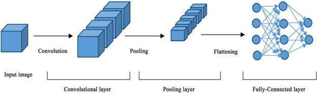
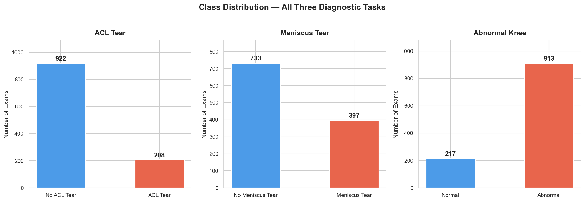
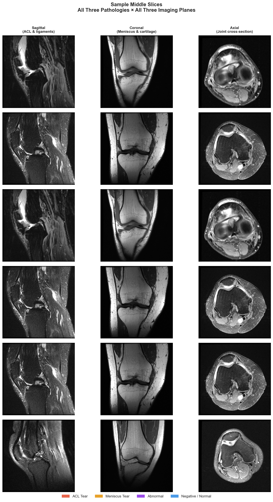
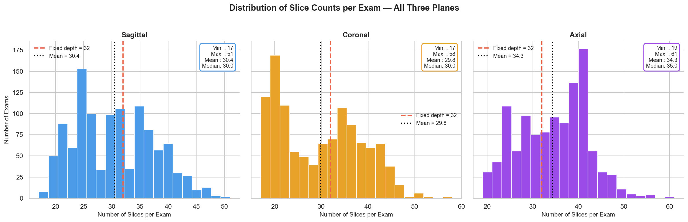
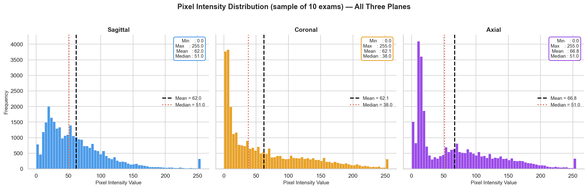
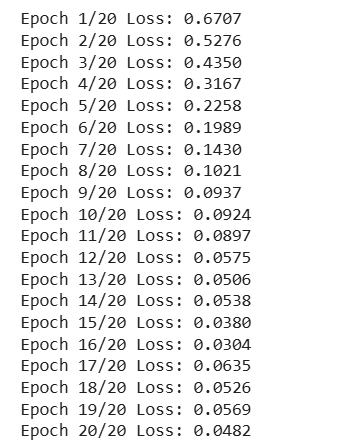
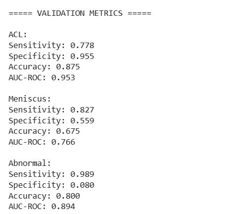

Slides: [slides.html](slides.html){target="_blank"} ( Go to `slides.qmd`
to edit)

## 1 Introduction
Musculoskeletal disorders affecting knee and related tissues like osteoarthritis, ACL injury and meniscal injury are widespread and greatly affect quality of life and mobility of patients globally. Current methods for diagnosis include X-ray radiography but these are ineffective for soft tissue diagnosis and, hence, diagnosis of early changes are often delayed until knee is significantly degenerated (Panwar et al. 2025). On the other hand, magnetic resonance imaging has emerged as a leading diagnostic method for musculoskeletal and sports medicine imaging due to several features, like high contrast resolution and multiplanar imaging, which can aid in thorough evaluation of large joints, like knee along with ligaments, cartilage, bone, tendons, and muscles, and provides distinct images of different soft tissues to get a complete overview (Qiu et al. 2021). However, current methods of MRI scans analysis manually pose huge challenge for radiologists due to time consumption, high rate of errors, low reproducibility, heavy cognitive load, and high inter-observer variability (Bien et al. 2018).

Manual segmentation of knee structures is a time-consuming step in MRI-based knee assessment. Deep learning methods can potentially improve this process by enabling fast and reproducible automated segmentation of knee tissues. In their study, Zhou et al. (2018) developed a deep convolutional neural network for automatic cartilage and meniscus segmentation of knee joints, achieving highly accurate results for multiple types of knee tissues, to facilitate efficient assessment of knee anatomy and pathology.

State-of-the-art artificial intelligence techniques based on deep learning (DL), particularly deep learning Convolutional Neural Networks (CNNs), allow for automated, objective, and scaleable image analysis, which constitutes a major paradigm shift for overcoming challenges in medical diagnostics. CNNs are especially suited for the analysis of medical images since they have the ability to learn automatically hierarchical features directly from raw pixel data. Including pathological changes that the human eye cannot even detect. 2D and 3D CNN models have recently shown promising results in the segmentation and even grading of musculoskeletal tissues and degree of damage of their structures. Although crucial advances have been achieved, however, there are more important challenges to be addressed, including the acquisition and labeling of a large, high-quality dataset and the lack of generalization capability in different MRI platforms and hardware.

Fast diagnosis and monitoring of patients is a current challenge. To address this problem, efficient automated systems for the multiplex detection and grading of diseases in time-consuming workflows are needed to help doctors. Although specialized models for particular tasks have been shown to be effective in the literature (e.g. ACL tears using self-supervised learning and meniscus degeneration staging), the problem of discrimination of multiple co-occurring knee injuries in the knee is still an open challenging problem. Based on recent CNN models, in this paper we present an automated system for the detection and grading of various knee common injuries and degeneration from knee MRI images. The system can enable early intervention and help develop strategies for better patient care.

Knee osteoarthritis assessment based on visual inspection of clinical images is traditionally time-consuming and operator-dependent. Recent studies indicate that knee osteoarthritis can be automatically detected and graded from imaging data using a deep learning-based convolutional neural network (CNN) approach, resulting in robust and accurate classification.

In this work we aim to develop a 3D Convolutional Neural Network (3D CNN) that can reliably identify whether an ACL is torn or not from a volumetric knee MRI. We utilize the Stanford MRNet dataset and evaluate our model as a binary classification problem between torn ACL and intact ACL. We utilize AUC, sensitivity and specificity as our main performance metrics for evaluation. We also train and evaluate a secondary comparison model based on a pre-trained 3D ResNet-18 architecture.

## 2 Methodology

### Convolutional Neural Network (CNN)

A Convolutional Neural Network (CNN) is a deep learning model specifically designed to process structured, grid-organized data such as images. CNNs have been highly successful in image processing and medical imaging because they can automatically learn relevant features directly from input images, eliminating the need for manual feature extraction.[@yeoh2021emergence;@awan2021improved]

In the early layers, CNNs capture fundamental spatial characteristics such as gradients and structural boundaries. As the network becomes deeper, it learns increasingly complex and abstract representations, including pathological changes like cartilage degeneration or disruption of the fibers of the anterior cruciate ligament(ACL).[@astuto2021automatic]

While 1D CNNs are typically used for sequential data and 2D CNNs for individual image slices, 3D CNNs extend convolution operations into the volumetric domain by incorporating depth in addition to height and width. This is particularly important in imaging modalities such as MRI, where spatial continuity across slices is essential.[@guida2021knee]

In knee MRI applications, 3D CNNs have demonstrated superior performance in detecting and grading ACL tears, meniscal degeneration, and osteoarthritis severity. By preserving inter-slice spatial relationships, these models provide a more comprehensive understanding of knee anatomy, positioning 3D CNNs at the forefront of advanced artificial intelligence systems in orthopedic imaging [@bien2018deep; @guida2021knee; @oettl2025beyond]..

### Basic Architecture of a CNN

 
A typical CNN consists of several key components that enable hierarchical feature extraction and classification [@yeoh2021emergence;@awan2021improved].

<center>

</center>

**1. Convolution Layer**

Applies filters (kernels) to extract features from input images.

      Mathematical representation:
$$
Y(i,j) = \sum_{m}\sum_{n} \left[ X(i+m, j+n)\cdot W(m,n) \right] + b
$$


Where:
- $X$ = Input image
- $W$ = Filter/kernel
- $b$ = Bias
- $Y$ = Output feature map

This operation allows CNNs to learn spatially localized features and is fundamental to many medical image analysis frameworks [@yeoh2021emergence; @qiu2021fusion].
	
**2. Activation Function**

Non-linear activation functions are applied after convolution to introduce non-linearity into the model, enabling it to learn complex patterns. The most commonly used activation function is the Rectified Linear Unit (ReLU):


$$
f(x) = \max(0, x)
$$
ReLU improves training efficiency and mitigates vanishing gradient issues in deep neural networks [@yeoh2021emergence ; @awan2021improved].

**3. Pooling Layer**

Pooling layers reduce the spatial dimensions of feature maps while preserving the most important information. Max pooling, one of the most commonly used pooling techniques, selects the maximum value within a sliding window. This operation helps reduce computational complexity and improves model robustness to small spatial variations [@yeoh2021emergence]  

**4. Fully Connected Layer**

Performs classification based on extracted features.These layers combine the learned representations to predict the target class, such as the presence or severity of knee pathology [@awan2021improved].

**5. Output Layer**

Uses Softmax (multi-class) or Sigmoid (binary/multi-label).

In medical imaging, CNNs have demonstrated strong performance in MRI-based diagnosis and tissue segmentation[@liu2018deep; @zhou2018deep].

---

### Types of CNN:

CNNs are categorized based on the dimensionality of the input data and the sliding direction of the kernel:

| Type   | Input Data Examples | Kernel Movement |
|--------|--------------------|-----------------|
| 1D CNN | Time-series, audio, ECG signals (Ige & Sibiya, 2024). | Slides along one dimension (time/sequence). |
| 2D CNN | Grayscale/RGB images, medical X-rays (Taye, 2023). | Slides along two dimensions (height and width). |
| 3D CNN | Videos, MRI/CT scans, 3D point clouds (Guida et al., 2021). | Slides along three dimensions (height, width, and depth). |
: Table 1: Types of Convolutional Neural Networks {.striped .hover .custom-table}

---

### 3D Convolutional Neural Networks:

A 3D Convolutional Neural Network (3D CNN) is an extension of the conventional 2D CNN architecture designed to process volumetric data by applying three-dimensional convolutional kernels across height, width, and depth. Unlike 2D CNNs, which analyze individual image slices independently, 3D CNNs preserve inter-slice spatial continuity, enabling the model to learn contextual anatomical relationships throughout the entire volume. This characteristic makes them particularly suitable for medical imaging modalities such as MRI, where structural information spans multiple slices.

In medical image analysis, 3D CNNs typically consist of stacked 3D convolutional layers, nonlinear activation functions, 3D pooling layers, and fully connected layers. The initial layers are responsible for learning low-level volumetric features, including edges and texture patterns, while deeper layers are geared toward learning high-level representations of anatomical structures and abnormalities. Although 3D CNNs are computationally expensive compared to 2D CNNs, 3D CNNs are capable of achieving state-of-the-art results in volumetric classification, detection, and segmentation tasks.

In the analysis of knee MRI scans, 3D CNNs have proven to perform well in different diagnostic tasks. The work by Nicholas Bien on the development of MRNet [@bien2018deep] proved the potential of deep learning networks in diagnosing anterior cruciate ligament tears and meniscal abnormalities with high accuracy. Following the success of MRNet,[@pedoia20193d]  adopted the application of 3D CNNs in the detection and staging of meniscal and patellofemoral cartilage degeneration.[@guida2021knee] adopted the 3D CNN framework in the classification of knee osteoarthritis based on MRI scans.

Apart from classification, 3D CNNs have also been used for anatomical segmentation.[@zhou2018deep; @liu2018deep] showed that deep convolutional networks can be used along with deformable modeling techniques to segment the tissues of the knee joint accurately, which is very important for quantitative musculoskeletal assessment.

Recent trends in research are further enhancing the capabilities of CNN-based systems. Self-supervised learning strategies such as BYOL have been explored for ACL tear detection to reduce reliance on large labeled datasets [@aidarkhan2025self]. Federated learning techniques have been proposed for developing systems that can perform knee injuries across multiple institutions without compromising patient data [@goel2025federated]. Most recently, emerging frameworks for multimodal and continuous monitoring are establishing AI systems as an integral part of future orthopedic care systems [@oettl2025beyond]. While alternative models such as Vision Transformers are being explored for developing systems that can grade the severity of osteoarthritis [@panwar2025early], 3D CNNs remain an established solution for volumetric knee MRI analysis.

Overall, 3D CNNs have an essential role to play in musculoskeletal imaging, as they can be utilized for the detection, classification, grading, and segmentation of knee pathologies in an automated manner. The 3D spatial relationships can be preserved with 3D CNNs, thus offering an anatomical understanding.

The 3D convolution is defined as:
  
$$
Y(i,j,k) = \sum_{m}\sum_{n}\sum_{p} X(i+m, j+n, k+p)\cdot W(m,n,p) + b
$$

Where:

- $X$ = Input 3D MRI volume
- $W$ = 3D convolution kernel
- $b$ = Bias
- $Y$ = Output feature map
- $i,j,k$ = Spatial voxel indices

This operation extracts volumetric features across depth, height, and width.[@guida2021knee].


#### Applications in Knee MRI Analysis

3D CNNs have demonstrated strong performance in musculoskeletal imaging, particularly in knee MRI analysis.

- **Tissue Segmentation:**  [@liu2018deep]  and [@zhou2018deep] have used deep CNN-based architectures to achieve the segmentation of knee joint anatomy, which has demonstrated better accuracy in tissue segmentation..

- **Meniscus and Cartilage Degeneration Detection:** [@pedoia20193d]  have used 3D CNN architectures to identify and stage the degenerative morphological changes in meniscus and patellofemoral cartilage, which emphasizes the need to extract volumetric features.

- **Osteoarthritis Classification:**  [@guida2021knee] have suggested a model based on the 3D CNN technique for the classification of knee osteoarthritis   using MRI, showing that the performance is enhanced compared to the 2D technique. Similarly, the effectiveness of the  CNN technique has been shown in the classification of osteoarthritis severity assessment by [@rani2024deep].

- **ACL Tear Detection:** [@bien2018deep] suggested the MRNet deep learning technique for the diagnosis of knee MRI. Recently, more efficient learning techniques such as self-supervised learning have been used in the detection of ACL tears using the MRI scan, as suggested in the study by [@aidarkhan2025self].

- **Multimodal and Federated Learning Approaches:** New frameworks have been developed to combine 3D CNNs with federated and few-shot learning techniques to achieve better generalization across institutions [@goel2025federated]. Moreover, the contribution of AI-based multimodal systems to the development of orthopedic diagnostics has been emphasized in the study done by [@oettl2025beyond].

#### Performance and Advantages:

3D CNNs provide significant benefits in medical imaging:

- **Volumetric Context:** They extract features from adjacent slices, detecting biomarkers (like cartilage degradation) that may be invisible in   a single 2D image [@guida2021knee].
	
- **Higher Accuracy:** Brain and knee imaging studies have established that the 3D model has higher dice scores and accuracy compared to the    2D and 2.5D approaches [@avesta2023comparing;@guida2021knee ].
	
- **Efficiency in Convergence:** 3D models can converge 20% to 40% faster during training than their 2D counterparts when dealing with volumetric data [@avesta2023comparing].

#### Limitations and Assumptions

Despite their power, 3D CNNs face specific challenges:

- **Computational Cost:** 3D models require significantly more computational memory (often up to 20 times more) compared to 2D models [@avesta2023comparing].
	
- **Large Data Requirements:** 
For CNNs, a large annotated dataset is required to achieve optimal performance. However, in the context of medical image datasets, the datasets are limited in size and expensive to label, thereby limiting the generalization of the models [@bien2018deep; @yeoh2021emergence]. Recent advances, such as self-supervised learning, aim to address this limitation [@aidarkhan2025self].   

- **Risk of Overfitting:**
Due to the limited nature of the medical image dataset, CNNs tend to overfit, especially when using a deep 3D structure [@awan2021improved; @rani2024deep]. 

## 3 Analysis & Results:

#### 3.1 Dataset Description:

The MRNet dataset, a publicly available set of knee MRI scans gathered by the School of Medicine at Stanford University, is used in this research. The dataset contains images gathered from clinical studies performed at the Stanford University Medical Center over an eleven-year period from 2001 to 2012.
The structure of the dataset is divided into a training and validation set, with each MRI study labeled for three different diagnoses: 

- The presence of any abnormality, 
- Tears of the anterior cruciate ligament (ACL),
- Meniscal injuries.

**3.1.2 Data Organization**
The dataset has a standardized partition structure, with a train/ directory for model development and a valid/ directory for model evaluation. The diagnostic ground truth is provided in the form of two CSV files, namely train-acl.csv and valid-acl.csv, each containing the examination identifier and a binary diagnostic label, where 0 represents the absence of an ACL tear and 1 represents a confirmed ACL tear.

**3.1.3 Problem Formulation**

The task of clinical diagnosis is posed as a binary classification problem, where the goal of the model is to distinguish between ACL-intact and ACL-compromised knee examinations. Mathematically, the binary classification problem can be stated as:

$$
y=\begin{cases}
0 & \text{No ACL tear present} \\ 
1 & \text{ACL tear present} 
\end{cases}
$$
This problem statement allows the construction of a supervised learning model that can be used to automatically identify ACL tears from multi-planar MRI images.


#### 3.2 Dataset Visualization & Exploratory Analysis:

Exploratory Data Analysis (EDA) is a fundamental component of any machine learning model's pipeline. It is critical to understand the structure and composition of the data before moving forward to train any model. This section of the report outlines a detailed exploratory data analysis of the MRNet dataset, proposed by [@bien2018deep]. in 2018, which consists of knee MRI images from three different imaging planes, i.e., sagittal, coronal, and axial. Each of these imaging sessions is associated with a binary variable representing the ACL tear condition of the knee. The class balance, volumetric structure, imaging characteristics, and cross-plane imaging of the MRNet dataset have all been addressed in the following visualizations, which were critical to the decisions made in the subsequent sections of this report.

**3.2.1 Class Distribution**


<details class="collapase">
<summary><b>Code</b></summary>

```python
class_counts = labels_df["diagnosis"].value_counts()

plt.figure(figsize=(6, 4))
ax = class_counts.plot(kind="bar",
                       color=["#4C9BE8", "#E8654C"],
                       edgecolor="white",
                       width=0.5)

# Add count labels on top of each bar
for bar in ax.patches:
    ax.text(
        bar.get_x() + bar.get_width() / 2,
        bar.get_height() + 1,
        str(int(bar.get_height())),
        ha="center", va="bottom", fontweight="bold"
    )

plt.title("Class Distribution – ACL Tear Labels", fontsize=13, fontweight="bold")
plt.xlabel("")
plt.ylabel("Number of Exams")
plt.xticks(rotation=0)
plt.tight_layout()
plt.show()
plt.savefig("figures/class_distribution.png", dpi=300)
```
</details>

<p>The bar chart describes the class distribution of the ACL tear labels in the data set. The horizontal axis indicates the two classes in the diagnostic results, namely "No ACL Tear" and "ACL Tear," while the vertical axis indicates the number of examinations in the data set. The data set contains a total of 1,130 examinations, with 922 (81.6%) labeled as "No ACL Tear" and 208 (18.4%) labeled as "ACL Tear." This is a significant imbalance between the two classes, with an approximate ratio of 4.4:1 in favor of the negative class. This imbalance is clinically realistic, since ACL tears are not as common in the general population as the converse; nonetheless, it is a significant methodological limitation in the application of supervised machine learning, since a model trained on such an unbalanced data set will likely develop a bias toward the majority class, thereby achieving high accuracy but at the expense of poor sensitivity for the clinically important minority class. This figure is important because it establishes the underlying data set characteristics that directly influence the model design, loss function, and evaluation metric used in the study.</p>

<center>
```{r}
#| echo: false
#| fig-cap: "Figure 3.1: Class distribution of ACL tear labels"
#| out-width: "70%"
#| fig-align: "center"
#| fig-cap-location: margin

```
</center>

**3.2.2 Sample Middle Slices from the Sagittal Plane**

<details class="collapase">
<summary><b>Code</b></summary>

```python
# Visualise Sample MRI Slices (Sagittal Plane)
# Grab exam IDs for each class
positive_ids = labels_df[labels_df["label"] == 1]["exam_id"].values[:2]
negative_ids = labels_df[labels_df["label"] == 0]["exam_id"].values[:2]

# Combine them with their labels for the plot title
sample_exams = [(eid, "ACL Tear")    for eid in positive_ids] + \
               [(eid, "No ACL Tear") for eid in negative_ids]

fig, axes = plt.subplots(1, 4, figsize=(14, 4))

for ax, (exam_id, diagnosis) in zip(axes, sample_exams):

   
    npy_path = os.path.join(DATA_DIR, "train", "sagittal", f"{exam_id:0>4}.npy")
    volume = np.load(npy_path)           # shape: (S, H, W)

    # Pick the middle slice as the most representative view
    middle_idx = volume.shape[0] // 2
    slice_img  = volume[middle_idx]      # shape: (H, W)

    ax.imshow(slice_img, cmap="gray")
    ax.set_title(f"ID: {exam_id}\n{diagnosis}", fontsize=10, fontweight="bold",
                 color="#E8654C" if diagnosis == "ACL Tear" else "#4C9BE8")
    ax.axis("off")

fig.suptitle("Sample Middle Slices – Sagittal Plane", fontsize=13, fontweight="bold")
plt.tight_layout()
plt.show()
```

</details>


<p>The following figure depicts four sample middle sagittal plane MRI slice images from the dataset, showing instances of both positive and negative ACL tear classes. As shown, each image has been labeled with the patient ID and the associated label, with "ACL Tear" instances depicted in red and "No ACL Tear" instances depicted in blue, based on their associated IDs 1 and 18, and 0 and 2, respectively. As depicted, the images have been shown in grayscale, consistent with standard MRI acquisition procedures. As shown, there are discernible structural differences in the ACL-tear and no ACL-tear classes, with the ACL-tear classes showing a lack of the characteristic linear hypointense feature representing the ligament, while the no ACL-tear classes show a well-defined ligamentous feature. However, discernible variability in knee orientation, contrast, and soft tissue intensity may be observed among the four sample images, showing the inherent variability in clinical data. As shown, the variability among the samples demonstrates the complexity of the classification task, warranting the use of deep learning architectures that are capable of learning complex hierarchical representations without relying on feature engineering.</p>

<center>
```{r}
#| echo: false
#| fig-cap: "Figure 3.2: Sample Middle Slices"
#| out-width: "70%"
#| fig-align: "center"

```
</center>

**3.2.3 Distribution of Slice Counts per Examination**

<details class="collapase">
<summary><b>Code</b></summary>

```python
# Slice Count Histogram

slice_counts = []

for exam_id in labels_df["exam_id"]:
    npy_path = os.path.join(DATA_DIR, "train", "sagittal", f"{exam_id:0>4}.npy")
    volume = np.load(npy_path)
    slice_counts.append(volume.shape[0])   # number of slices

labels_df["num_slices"] = slice_counts

plt.figure(figsize=(7, 4))
plt.hist(labels_df["num_slices"], bins=20, color="#4C9BE8", edgecolor="white")
plt.title("Distribution of Slice Counts (Sagittal Plane)", fontsize=13, fontweight="bold")
plt.xlabel("Number of Slices per Exam")
plt.ylabel("Number of Exams")
plt.tight_layout()
plt.show()

# Quick stats
print(f"Min slices : {labels_df['num_slices'].min()}")
print(f"Max slices : {labels_df['num_slices'].max()}")
print(f"Mean slices: {labels_df['num_slices'].mean():.1f}")
```

</details>


<p>The above histogram shows the distribution of the number of slices in the sagittal plane for each MRI exam. The horizontal axis shows the number of slices in each exam. This varies from around 15 slices to around 50 slices. The vertical axis shows the number of exams. The distribution of slices in the sagittal plane appears to be approximately unimodal. The main peak occurs at around 25 slices per exam, with approximately 150 exams. There is a smaller peak around 30-35 slices per exam, with around 100-110 exams. The distribution of slices in the sagittal plane appears skewed to the right. This means that a long tail of the distribution goes towards a maximum of 50 slices per exam. Here, the number of exams is less than 5. This variation in the number of slices in the sagittal plane arises due to the inherent variation in clinical images. This variation arises because different imaging protocols are followed in different hospitals and institutions. This figure is of great importance as it guides the way in which the volumetric inputs are standardized during the pre-processing stage.</p>

<center>

```{r}
#| echo: false
#| fig-cap: "Figure 3.3: Distribution of Slice Counts"
#| out-width: "70%"
#| fig-align: "center"

```
</center>

**3.2.4 Pixel Intensity**

<details class="collapase">
<summary><b>Code</b></summary>

```python

# Pixel Intensity Histogram

# Only load a small sample to avoid slow runtimes
n_sample  = 10
sample_ids = labels_df["exam_id"].sample(n=n_sample, random_state=42).values

all_pixels = []

for exam_id in sample_ids:
    npy_path = os.path.join(DATA_DIR, "train", "sagittal", f"{exam_id:0>4}.npy")
    volume = np.load(npy_path).astype(np.float32)

    # Flatten volume and take a random subset of pixels (for speed)
    flat = volume.ravel()
    sample_px = flat[np.random.choice(len(flat), size=3000, replace=False)]
    all_pixels.append(sample_px)

all_pixels = np.concatenate(all_pixels)

plt.figure(figsize=(7, 4))
plt.hist(all_pixels, bins=60, color="#E8A84C", edgecolor="white")
plt.title(f"Pixel Intensity Distribution (sample of {n_sample} exams)",
          fontsize=13, fontweight="bold")
plt.xlabel("Pixel Intensity Value")
plt.ylabel("Frequency")
plt.tight_layout()
plt.show()

print(f"Intensity range: {all_pixels.min():.1f} – {all_pixels.max():.1f}")
print(f"Mean intensity : {all_pixels.mean():.1f}")
```

</details>


<p>The histogram in the above image demonstrates the pixel intensity values for a random selection of ten images. The horizontal axis of the histogram ranges from values lower than 0 up to 255. The vertical axis of the histogram corresponds to the values’ frequencies. The values are highly skewed towards the right. The highest frequency values are concentrated in the lower intensity values and reach a peak of around 20-25. The frequency value in this region approaches 2000. After this peak, the values decrease gradually as the intensity increases. This demonstrates that the pixels in an MRI image are not uniformly distributed. The presence of a secondary peak of around 300 occurs when the intensity reaches its maximum value of 255. This could be due to the presence of pixels in images of joint effusion. This figure is useful as it justifies the normalization of all the images before they are fed into the model for training.</p>

<center>
```{r}
#| echo: false
#| fig-cap: "Figure 3.4: Pixel Intensity"
#| out-width: "70%"
#| fig-align: "center"

```
</center>


# 3.3 Modeling and Results

Our data preprocessing focused on preparing 3D MRI volumes for input into a deep learning model. The dataset consisted of knee MRI scans stored as NumPy arrays, along with three associated labels for each exam: ACL tear, meniscus tear, and abnormality.

Each MRI scan is a 3D volume composed of multiple 2D slices. Since the number of slices varies across exams, we standardized all inputs to a fixed depth of 32 slices. Volumes with more than 32 slices were truncated, while those with fewer slices were padded with zeros. This ensured consistent input dimensions for the model.

We implemented a 3D convolutional neural network using a pretrained 3D ResNet-18 architecture. The pretrained model was loaded and the final fully connected layer of the network was modified to output three values corresponding to the three prediction tasks: ACL tear, meniscus tear, and abnormality. Since each condition is independent, the model performs multi-label classification.

<details class="collapase">
<summary><b>Code</b></summary>

```python

# Code used for modeling

import torchvision.models.video as models
import torch.nn as nn

class MRNet3DResNet(nn.Module):
    def __init__(self):
        super().__init__()

        # Load pretrained 3D ResNet
        self.model = models.r3d_18(pretrained=True)

        # Modify final layer for 3 outputs
        self.model.fc = nn.Linear(self.model.fc.in_features, 3)

    def forward(self, x):
        return self.model(x)
        
```

</details>

Model Training

The model was trained using batches of MRI volumes. Since the pretrained ResNet expects 3-channel input, the single-channel MRI volumes were duplicated across three channels.
We used the Binary Cross-Entropy loss function with logits, which is appropriate for multi-label classification. Class weights were applied to address imbalance in the dataset. The Adam optimizer was used to update model weights.

<details class="collapase">
<summary><b>Code</b></summary>

```python

# Code used for for training setup:

device = torch.device("cuda" if torch.cuda.is_available() else "cpu")

model = MRNet3DResNet().to(device)

pos_weight = torch.tensor([2.0, 2.0, 1.5]).to(device)
criterion = nn.BCEWithLogitsLoss(pos_weight=pos_weight)

optimizer = torch.optim.Adam(model.parameters(), lr=1e-4)

epochs = 20

#Code used for training loop:

for epoch in range(epochs):

    model.train()
    total_loss = 0

    for volumes, labels in train_loader:

        volumes = volumes.to(device)
        labels = labels.to(device)

        optimizer.zero_grad()

        # Convert 1 channel → 3 channels
        volumes = volumes.repeat(1, 3, 1, 1, 1)

        outputs = model(volumes)

        loss = criterion(outputs, labels)

        loss.backward()
        optimizer.step()

        total_loss += loss.item()

    print(f"Epoch {epoch+1}/{epochs} Loss: {total_loss/len(train_loader):.4f}")
        
```

</details>

Results :

# 3.3.1 Training performance:

The model was trained for 20 epochs, and the training loss consistently decreased from 0.6707 to 0.0482, indicating that the model successfully learned patterns from the MRI data.
The most significant improvements occurred during the early epochs, with slower convergence in later epochs. Minor fluctuations suggest possible overfitting but overall stable convergence.

<details class="collapase">
<summary><b>Code</b></summary>

```python

#Code used to generate training results:

print(f"Epoch {epoch+1}/{epochs} Loss: {total_loss/len(train_loader):.4f}")
```

</details>

Training loss output:

<center>

</center>


# 3.3.2 Validation Metrics:

After training, the model was evaluated on the validation dataset. Predictions were converted into probabilities using a sigmoid function and then thresholded at 0.5 to produce binary outputs.

Performance was measured using sensitivity, specificity, accuracy, and AUC-ROC for each condition.


<details class="collapase">
<summary><b>Code</b></summary>

```python

# Code used for evaluation:

model.eval()

all_labels = []
all_preds = []
all_probs = []

with torch.no_grad():
    for volumes, labels in valid_loader:

        volumes = volumes.to(device)
        volumes = volumes.repeat(1, 3, 1, 1, 1)

        outputs = model(volumes)

        probs = torch.sigmoid(outputs).cpu().numpy()
        preds = (probs > 0.5).astype(int)

        all_probs.extend(probs)
        all_preds.extend(preds)
        all_labels.extend(labels.numpy())
```

</details>


<details class="collapase">
<summary><b>Code</b></summary>

```python

# Code used for metrics calculation:

from sklearn.metrics import roc_auc_score, confusion_matrix

def compute_metrics(y_true, y_pred, y_prob):

    tn, fp, fn, tp = confusion_matrix(y_true, y_pred).ravel()

    sensitivity = tp / (tp + fn + 1e-6)
    specificity = tn / (tn + fp + 1e-6)
    accuracy = (tp + tn) / (tp + tn + fp + fn)
    auc = roc_auc_score(y_true, y_prob)

```

</details>


# 3.3.3 Results for metric evaluations:

<details class="collapase">
<summary><b>Code</b></summary>

```python

# Code used to print results:
labels_names = ["ACL", "Meniscus", "Abnormal"]

for i, name in enumerate(labels_names):

    sens, spec, acc, auc = compute_metrics(
        all_labels[:, i],
        all_preds[:, i],
        all_probs[:, i]
    )

    print(f"\n{name}:")
    print(f"Sensitivity: {sens:.3f}")
    print(f"Specificity: {spec:.3f}")
    print(f"Accuracy: {acc:.3f}")
    print(f"AUC-ROC: {auc:.3f}")
```

</details>

Metrics Evaluation output:

<center>



**3.3.4 Summary of the evaluation metrics:**

- **ACL:** Strong performance with high specificity (0.955) and AUC (0.953)

- **Meniscus:** Moderate performance with lower specificity (0.559)

- **Abnormal:** Very high sensitivity (0.989) but extremely low specificity (0.080), indicating overprediction


These results suggest that the model performs well overall but may require threshold tuning or class balancing to improve specificity, particularly for abnormality detection.


## Conclusion


## References
