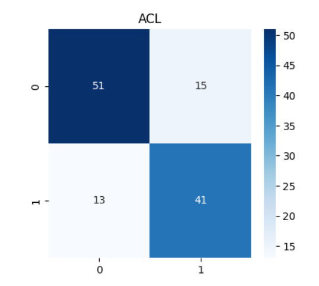
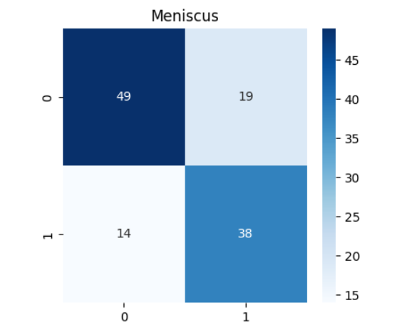
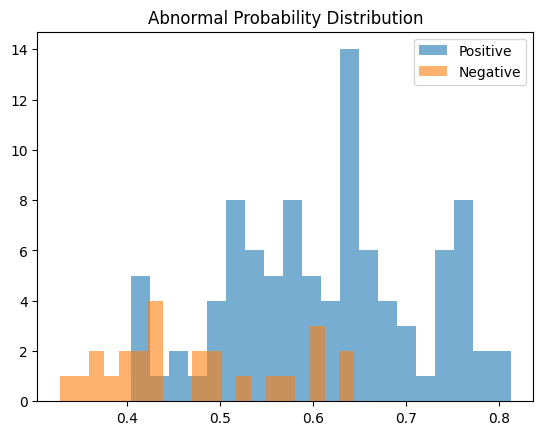
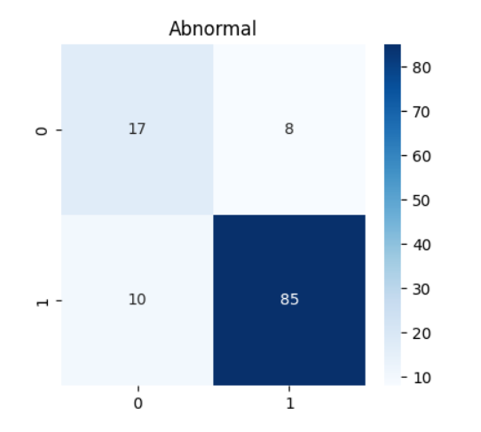

---

## Introduction

:::: {.columns}

::: {.column width="52%"}

### The Clinical Problem
- Knee disorders including osteoarthritis and ACL and meniscal tears are some of the most common musculoskeletal disorders worldwide.
- X-ray does not show soft tissue very well. Early changes are easily overlooked.
- MRI is considered the "gold standard" due to high contrast, multiplanar imaging and excellent soft-tissue detail.

### Why MRI Needs AI?
- Machine assisted MRI reading is fast, reliable and removes variability between readers.
- Analysis of medical images and clinical documents can aid diagnosis, but requires automation to increase effectiveness.


:::

::: {.column width="48%"}

{.intro-img}

:::

::::


---

## Research Objective

**Core Research Question**

> Can a 3D CNN learn spatial and anatomical information from multi-plane knee MRI volumes to accurately detect multiple knee pathologies simultaneously?

- Develop and train a 3D Convolutional Neural Network that can simultaneously detect ACL, Meniscus, and general knee abnormalities.

- Use the Stanford MRNet dataset which is a publicly available collection of clinical knee MRI scans from multiple centers collected between 2001 and 2012.

- This task requires developing three separate dual-classification problems and assessing them individually as well as jointly.
Deep Fusion (multi-plane fusion: sagittal + coronal + axial) with learnable plane-attention weights.

- Evaluate AUC-ROC, accuracy, sensitivity, specificity, F1-score - for all three classification tasks.

**Three Binary Classification Tasks**

| Task | What is Detected | Clinical Use |
|---|---|---|
| ACL Tear | Ligament rupture present (1) vs. absent (0) | Surgical planning |
| Meniscus Tear | Meniscal damage present (1) vs. absent (0) | Surgical vs. conservative care |
| Abnormality | Any knee pathology present (1) vs. absent (0) | Screening and triage |

---

## Dataset: Stanford MRNet

:::: {.columns}

::: {.column width="50%"}

- Open knee MRI data set - Stanford University School of Medicine
- Clinical scans collected from 2001–2012 (11-year period)
- Each study is provided in 3 imaging planes, (Sagittal, Coronal, Axial)
- Capable of being used for 3 binary diagnostic projects: ACL tear, Meniscus tear, Any Abnormality.
- Binary classification label format: binary CSV (0s and 1s where 1s indicate presence).

:::

::: {.column width="50%"}

{.dataset-img}

::: {.warning-box}
⚠ ACL imbalance: 4.4:1 | Abnormal imbalance: 4.2:1 (reversed)  
Mitigated by Focal Loss + data augmentation + Youden's Index thresholding
:::

:::

::::

```{=html}
<div class="stat-row">
  <div class="stat-box"><strong>1,130</strong>Total MRI Studies</div>
  <div class="stat-box"><strong>3</strong>Imaging Planes</div>
  <div class="stat-box"><strong>3</strong>Diagnostic Tasks</div>
  <div class="stat-box"><strong>11 yrs</strong>Data Collection</div>
</div>
```
---

## Exploratory Data Analysis

:::: {.columns}

::: {.column width="52%"}

```{=html}
<div class="plane-cards">
  <div class="plane-card">
    <div class="plane-title">Sagittal</div>
    <div class="plane-stat">μ = 30.4 slices</div>
    <div class="plane-range">Range: 17–51</div>
    
  </div>
  <div class="plane-card">
    <div class="plane-title">Coronal</div>
    <div class="plane-stat">μ = 29.8 slices</div>
    <div class="plane-range">Range: 17–58</div>

  </div>
  <div class="plane-card">
    <div class="plane-title">Axial</div>
    <div class="plane-stat">μ = 34.3 slices</div>
    <div class="plane-range">Range: 19–61</div>
  </div>
</div>
```

- **Preprocessing Decision**

- Variable slice depth normalised to standardise all to 32 slices (cropped or zero-padded)
- Pixel intensity: right-skewed with major contributions from the 0–80 intensity range consistent with expected T2-weighted knee MRI signal.
- Per-channel zero-mean unit variance normalization (standardization) improves training stability for 3D CNN.
- Visual examination revealed widespread disease throughout the specimen, affecting multiple 10 mm sections, therefore a three-dimensional analysis was warranted.

:::

::: {.column width="52%"}

{.eda-img}

:::

::::

---

## Methodology: 3D CNN Architecture


:::: {.columns}

::: {.column width="50%"}

**Key Observations**
Why 3D CNN Instead of 2D CNN?
- 2D CNNs process each slice independently — no spatial context across depth  
- 3D CNNs apply kernels across height, width, and depth simultaneously  
- This preserves inter-slice relationships essential for volumetric knee anatomy  

:::

::: {.column width="50%"}

{width="100%"}

:::

::::


---

## Training Setup

**Hyperparameters**

| Parameter | Value |
|---|---|
| Optimizer | Adam with weight decay |
| Learning rate scheduler | ReduceLROnPlateau |
| Epochs | 15 |
| Loss function | Focal Loss (γ = 2, α = 0.75) |
| Batch | 2 (due to 3D CNN memory cost) |
| Decision threshold | Youden's Index (per task) |

**Addressing Class Imbalance**

- **Focal Loss** — Focuses on hard, misclassified examples
  - Formula: FL(p) = −α(1−p)^γ · log(p)
- **Data Augmentation** — random flips, rotations, and intensity scaling during training
- **Youden's Index** — Maximises (Sensitivity + Specificity − 1)
  - Avoids bias from default 0.5 threshold.
  
---

**Training Behaviour**

:::: {.columns}

::: {.column width="58%"}

- Loss decreased steadily from 0.110 to 0.094 over 15 epochs  
- Stable convergence observed after ~epoch 10  
- No strong signs of overfitting  
- Regularisation via: Dropout, Focal Loss  

:::

::: {.column width="42%"}


:::

::::

---

## Results: ACL Tear Detection

:::: {.columns}

::: {.column width="50%"}

{width="100%"}

:::

::: {.column width="50%"}

{width="100%"}

:::

::::


**Key Observations**

- The model shows reasonable separation between ACL and non-ACL cases, with some overlap in the            mid-probability range indicating uncertain predictions.  
- The confusion matrix shows a balanced trade-off between sensitivity and specificity.  
- Moderate false positives and false negatives are present, indicating room for improvement.  


---

## Results: Meniscus Tear Detection

:::: {.columns}

::: {.column width="50%"}

{width="100%"}

:::

::: {.column width="50%"}

{width="100%"}

:::

::::


**Key Observations**

- The probability density function shows that the Model exhibits weaker class separation compared to ACL.   Overlap region leads to higher false positives.

- The confusion matrix shows higher false positives indicate over-prediction of tears.
  More challenging classification compared to ACL  


---

## Results: Abnormality Detection


:::: {.columns}

::: {.column width="50%"}

{width="100%"}

:::

::: {.column width="50%"}

{width="100%"}


:::

::::


**Key Observations**


- The probability density function shows that model is very high sensitivity (strong detection of          abnormal cases) and the model  is biased toward predicting “abnormal” class more often

- The confusion matrix shows higher false positives indicate over-prediction of tears.
  More challenging classification compared to ACL. 

---

## Summary of Results

**Validation Metrics — All Three Tasks**

| Pathology | AUC-ROC | Accuracy | Sensitivity | Specificity | F1-Score |
|---|---|---|---|---|---|
| ACL Tear | 0.827 | 0.767 | 0.759 | 0.773 | 0.745 |
| Meniscus Tear | 0.746 | 0.725 | 0.731 | 0.721 | 0.697 |
| **Abnormality** | **0.833** | **0.850** | **0.895** | 0.680 | **0.904** |

**Learned Plane Attention Weights**


> The model independently learned to prioritise the sagittal plane — consistent with established radiological practice — without any explicit supervision.

---

## Conclusion 

- We present a custom 3D CNN that simultaneously identifies three knee pathologies from volumetric MRI scans on the publicly available Stanford MRNet dataset.

- For the diagnosis of ACL tears, the model obtained an AUC of 0.827 along with sensitivity and specificity of 0.759 and 0.773, respectively, and an F1-score of 0.745.

- We particularly note that meniscus tear detection was most challenging; however, the model performed with AUC of 0.746, a sensitivity of 0.731 and an F1-score of 0.697. Performance is strong enough for clinical use.

- Abnormality detection was found to have the best results in the experiments, which achieved AUC of 0.833, accuracy of 0.895, and F1-score of 0.904.

- The weights of the learned plane-attention weights (0.355 sagittal, 0.344 axial, 0.305 coronal) reflect how radiologists generally prioritize the different views and correspond to how a model decides where to look next, showing how the model’s behavior mirrors the way radiologists think.

- Our results demonstrate the potential of our deep learning approach to assist in MRI triage and alleviate some of the workload on radiologists.

---

## Future Work

```{=html}
<div class="fw-grid">

  <div class="fw-card">
    <div class="fw-header">
      <div class="fw-num">01</div>
      <div class="fw-title">Larger & Multi-Centre Datasets</div>
    </div>
    <div class="fw-body">Access diverse, multi-institution datasets to improve model generalization across MRI platforms and patient populations</div>
  </div>

  <div class="fw-card">
    <div class="fw-header">
      <div class="fw-num">02</div>
      <div class="fw-title">Semi-Supervised & Self-Supervised Learning</div>
    </div>
    <div class="fw-body">Leverage unlabeled MRI data using methods like BYOL to reduce dependence on expensive manual annotation</div>
  </div>

  <div class="fw-card">
    <div class="fw-header">
      <div class="fw-num">03</div>
      <div class="fw-title">Federated Learning</div>
    </div>
    <div class="fw-body">Train across institutions without sharing patient data — preserving privacy while benefiting from larger effective datasets</div>
  </div>

  <div class="fw-card">
    <div class="fw-header">
      <div class="fw-num">04</div>
      <div class="fw-title">Vision Transformer Architectures</div>
    </div>
    <div class="fw-body">Explore transformer-based volumetric models that capture long-range spatial relationships beyond the local scope of convolutional kernels</div>
  </div>

  <div class="fw-card">
    <div class="fw-header">
      <div class="fw-num">05</div>
      <div class="fw-title">Prospective Clinical Validation</div>
    </div>
    <div class="fw-body">Validate the model on independently collected, expert-annotated datasets with prospective radiologist ground truth</div>
  </div>

  <div class="fw-card">
    <div class="fw-header">
      <div class="fw-num">06</div>
      <div class="fw-title">Multimodal Integration</div>
    </div>
    <div class="fw-body">Combine MRI data with clinical metadata (age, BMI, patient history) for richer diagnostic predictions</div>
  </div>

</div>
```

---

## References

- Avesta, Arman, Sajid Hossain, MingDe Lin, Mariam Aboian, Harlan M Krumholz, and Sanjay Aneja. 2023. “Comparing 3D, 2.5 d, and 2D Approaches to Brain Image Auto-Segmentation.” Bioengineering 10 (2): 181.

- Awan, Mazhar Javed, Mohd Shafry Mohd Rahim, Naomie Salim, Amjad Rehman, Haitham Nobanee, and Hassan Shabir. 2021. “Improved Deep Convolutional Neural Network to Classify Osteoarthritis from Anterior Cruciate Ligament Tear Using Magnetic Resonance Imaging.” Journal of Personalized Medicine 11 (11): 1163. https://doi.org/10.3390/jpm11111163.

- Bien, Nicholas, Pranav Rajpurkar, Robyn L Ball, Jeremy Irvin, Allison Park, Erik Jones, Michael Bereket, et al. 2018. “Deep-Learning-Assisted Diagnosis for Knee Magnetic Resonance Imaging: Development and Retrospective Validation of MRNet.” PLoS Medicine 15 (11): e1002699. https://doi.org/10.1371/journal.pmed.1002699.

---

## {.thank-you-slide}

```{=html}
<div class="ty-container">
  <div class="ty-title">Thank You</div>
  <div class="ty-line"></div>
  <div class="ty-names">Bala Raju Pidatala &nbsp;|&nbsp; Sabna Balasubramoniapillai</div>
  <div class="ty-advisor">Advisor: Dr. Archaf Cohen</div>
  <div class="ty-course">IDC 6940 — Capstone Projects in Data Science &nbsp;|&nbsp; Spring 2026</div>
  <div class="ty-footer">Detection of Knee Pathologies from MRI Using Deep Learning Models (CNNs)</div>
</div>
```

